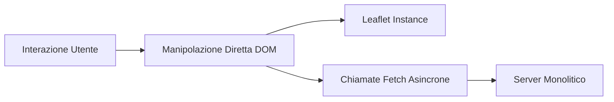
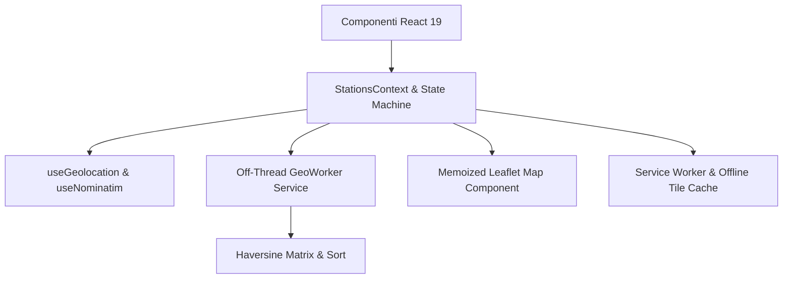
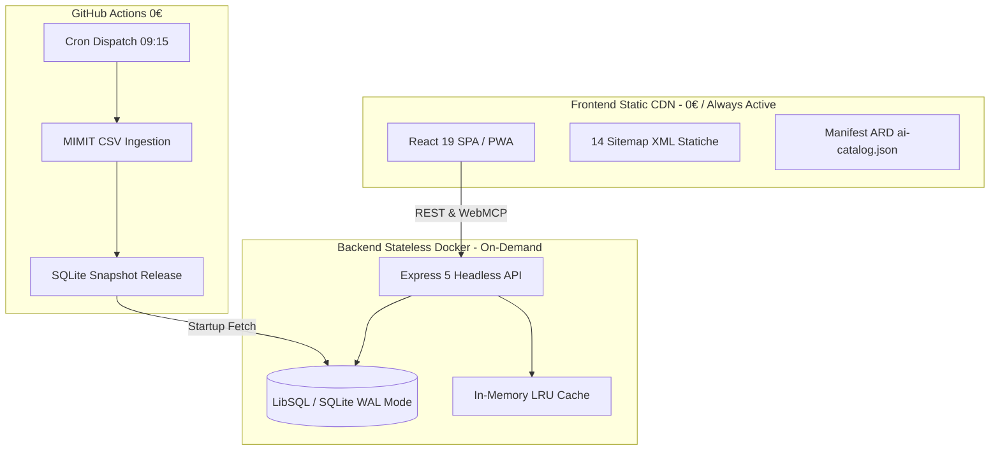

# 🏛️ FuelFinder Italy: Evoluzione Architetturale e Retrospettiva Tecnica

Questo documento ripercorre l'evoluzione ingegneristica di **FuelFinder Italy**, documentando i problemi concreti affrontati, le scelte di refactoring e le soluzioni architetturali adottate durante i tre grandi passaggi generazionali della piattaforma:

1. **Dall'approccio imperativo Vanilla JS al paradigma dichiarativo React**
2. **Dal monolite accoppiato alla SPA reattiva con PWA e Web Worker**
3. **Dal monolite monorepo al Monorepo Workspace Disaccoppiato per il Cloud Free-Tier**

---

## 1. Fase I: L'era Vanilla JS e i Limiti dell'Approccio Imperativo

### 1.1. Lo Stato Iniziale

Nelle prime iterazioni, FuelFinder era concepito come una classica applicazione web monolitica incentrata su file script monolitici, manipolazione manuale del DOM tramite `document.getElementById` / `innerHTML` e chiamate `fetch` sparse.

1. **Complessità dello Stato e Sincronizzazione UI:**
   - La combinazione di filtri multipli (tipologia carburante, raggio di ricerca, modalità self/servito, ordinamento prezzo/distanza) richiedeva l'aggiornamento manuale di decine di elementi DOM.
   - Ogni modifica a un filtro rischiava di lasciare la mappa e la tabella stazioni disallineate.
2. **Race Conditions e Ricerca Instabile:**
   - Durante la digitazione nella barra di ricerca geografica (OpenStreetMap Nominatim), risposte asincrone lente sovrascrivevano risposte successive più recenti (*out-of-order execution*), generando risultati errati per l'utente.
3. **Colli di Bottiglia sul Main Thread:**
   - L'inserimento diretto di centinaia di nodi DOM per i marker di Leaflet e il calcolo della distanza trigonometrica per migliaia di distributori causavano *jank* evidente e cali di framerate (< 25 FPS) su dispositivi mobili.

---

## 2. Fase II: La Transizione a React, PWA e Calcolo Off-Thread

Per superare i limiti dell'approccio imperativo, l'intero frontend è stato riscritto adottando **React 19**, **Vite** e una pipeline dichiarativa a componenti.

### 2.1. Soluzioni Ingegneristiche Introdotte

1. **Gestione Unificata dello Stato (`StationsContext`):**
   - Centralizzazione della pipeline dati in un unico contesto reattivo, sincronizzando istantaneamente mappa, sidebar, filtri e parametri URL.
2. **Eliminazione delle Race Condition con `AbortController`:**
   - Implementazione del custom hook `useNominatim` con cancellazione automatica della richiesta precedente all'inizio di una nuova digitazione e cache LRU client-side.
3. **Offloading Computazionale sui Web Worker (`geoWorkerService.js`):**
   - Il calcolo della matrice di distanza Haversine per oltre 20.000 impianti è stato spostato in un thread secondario dedicato via Web Worker, preservando i 60 FPS costanti sul main thread dell'interfaccia.
4. **PWA e Tile Caching a Livello di Rete:**
   - Creazione di un Service Worker con strategia `Stale-While-Revalidate` e cache LRU limitata a 500 tile geografiche, garantendo la navigazione delle mappe anche in assenza di connessione di rete.

---

## 3. Fase III: Il Disaccoppiamento Monorepo Workspace e la Cloud Optimization

Con l'aumento del volume dei dati (database nazionale MIMIT aggiornato quotidianamente con oltre 23.000 impianti), l'architettura accoppiata in un unico container Docker presentava nuove sfide sui servizi di hosting gratuiti (Render Free Tier).

### 3.1. I Problemi dell'Accoppiamento Monolitico

1. **Spreco di Risorse Cloud (750h/mese):**
   - Inizialmente, il server Node.js si occupava sia del serving statico/SSR sia del download ed elaborazione intensiva dei file CSV ministeriali, consumando CPU e superando i limiti del piano free.
2. **Cold Start Bloccante durante la Migrazione Dominio:**
   - Durante il passaggio a `fuelfinder-italia.onrender.com`, Googlebot tentava di verificare i redirect 301 sul vecchio host `fuelfinder-msn8.onrender.com`. Il download del database SQLite all'avvio causava un tempo di risposta > 5s, generando l'errore *"Impossibile recuperare la pagina"* su Google Search Console.
3. **Collisione tra Routing SPA e Crawler AI (Specifiche ARD):**
   - I bot di audit per l'individuabilità degli agenti AI cercavano manifest come `/.well-known/ai-catalog.json`. In assenza di file fisici, la regola catch-all della SPA restituiva la pagina `index.html` con status 200, provocando errori di parse JSON (`Unexpected token '<'`).

### 3.2. Soluzioni Architetturali Adottate

1. **Workspace Decoupled Monorepo (`pnpm-workspace.yaml`):**
   - Separazione netta tra `client/` (Frontend React Statico) e `server/` (Backend API Headless).
   - Frontend distribuito su **Global Edge CDN** a costo zero (TTFB < 30ms, zero cold-start).
   - Backend distribuito come Web Service leggero in container Docker Node 22 Alpine (< 80 MB RAM).
2. **Migrazione Sync su GitHub Actions:**
   - Lo scaricamento e la normalizzazione dei CSV MIMIT sono stati delegati interamente a un workflow automatizzato su GitHub Actions, che compila il database SQLite e lo pubblica come asset di rilascio. Il backend in avvio scarica lo snapshot compresso già pronto in pochi millisecondi.
3. **Redirector Legacy 301 a Zero Dipendenze:**
   - Sul branch `main` (vecchio host), il server è stato convertito in un redirector 301 puro con bypass del DB (`MIGRATION_REDIRECTOR=true`), riducendo il TTFB a < 200ms e consentendo la validazione istantanea da parte di Search Console.
4. **Standardizzazione ARD (Agent Resource Discovery) & SEO Chunking:**
   - Implementati i manifest `ai-catalog.json` e `ard.json` per l'interoperabilità con agenti AI e server Web MCP.
   - Generate 14 sitemap XML statiche suddivise per lingua e carburante, pre-compresse in formato Brotli (.br) e Gzip (.gz).
5. **Quality Gates & Zero-Alert Enforcement:**
   - 100.0% di copertura test su 4 metriche (Lines, Functions, Statements, Branches) con Vitest e Playwright E2E.
   - Script di pre-flight security locale (`scripts/security-audit.js`) e scansione statica con Oxlint e CodeQL (zero alert di sicurezza).

---

## 4. Riepilogo Comparativo delle Fasi

| Dimensione | Fase I: Vanilla JS Monolito | Fase II: React SPA / PWA | Fase III: Monorepo Decoupled & ARD |
| :--- | :--- | :--- | :--- |
| **Architettura UI** | Imperativa (DOM Diretto) | Dichiarativa (React 19 + Vite) | Componenti modulari + Web Worker off-thread |
| **Calcolo Distanze** | Main Thread sincrono | Main Thread asincrono | Web Worker dedicato in background a 60 FPS |
| **Gestione Rete** | Chiamate `fetch` non coordinate | Hook dedicati con `AbortController` | Cache LRU, ETag HTTP 304, Retry esponenziale |
| **Deployment & Hosting** | Singolo server monolitico | Singolo container SSR/Static | Static CDN (Client) + Docker Web Service (API) |
| **Costo Infrastruttura** | Elevato consumo CPU | Limiti del Free Tier | 0.00€ / Mese (Zero ore consumate per il Sync) |
| **AI & Agentic Web** | Non supportato | `llms.txt` di base | ARD 1.0 (`ai-catalog.json`), WebMCP nativo |
| **Test Suite** | Assente | Unit test parziali | 100.0% Full-Metric Coverage (Unit, Integration, E2E) |

---

## 5. Visione Futura e Scalabilità

Grazie al completo disaccoppiamento architetturale e all'isolamento delle responsabilità:

- L'interfaccia utente beneficia dell'affidabilità e della velocità della distribuzione Edge CDN.
- L'infrastruttura backend rimane priva di stato (*stateless*) e scalabile orizzontalmente.
- La conformità agli standard web aperti (Open Data MIMIT, Schema.org, ARD, PWA) assicura longevità e interoperabilità con la nuova generazione di motori di ricerca e assistenti intelligenti.
